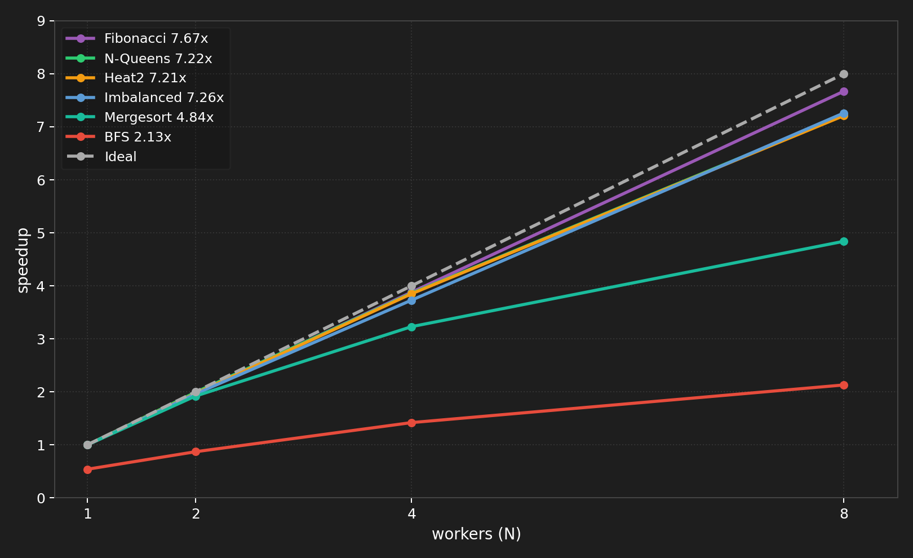

# M:N Green Thread Runtime with Work-Stealing Scheduler

**Roshni Ramesh (roshnir) and Wasmir Chowdhury (wchowdhu)** · Carnegie Mellon University · 15-418 Spring 2025

---

## Summary

We implemented an M:N green thread runtime with a work-stealing scheduler in C++. The system maps M lightweight fibers onto N kernel threads using hand-written x86-64 context switching, per-worker Chase-Lev work-stealing deques, and a WaitForCounter dependency primitive inspired by Naughty Dog's PS4 game engine. We overcame three major technical challenges: a Chase-Lev deque ownership violation causing intermittent lost fibers, a thundering herd problem reducing steal efficiency to 1.5%, and a race condition in the WaitForCounter wakeup path. Our final scheduler achieves **18.3x lower context switch latency** than pthreads, near-linear scaling across compute-bound workloads, and **7.67x speedup on parallel Fibonacci** — within 4% of the Blumofe-Leiserson theoretical bound. We evaluate across seven benchmarks spanning the full range of the T₁/P + O(T∞) bound, from near-linear speedup on embarrassingly parallel workloads to T∞-limited speedup on graph algorithms with short diameter.

---

## Background and Motivation

### The M:N Threading Model

Traditional 1:1 threading maps each application thread directly to a kernel thread. When a thread blocks waiting for a dependency, the kernel thread sleeps — wasting a core. For workloads with many fine-grained dependencies, this is expensive. The M:N model decouples execution contexts (fibers) from kernel threads (workers). M fibers share N kernel threads. When a fiber blocks, the kernel thread immediately picks up another runnable fiber. This keeps all N cores fully utilized even when many fibers are waiting.

### Work Stealing and the Blumofe-Leiserson Bound

Blumofe and Leiserson (1999) proved that a randomized work-stealing scheduler achieves expected execution time **T₁/P + O(T∞)** where T₁ is total work, P is processors, and T∞ is the critical path length. This is optimal — no scheduler can do better than T₁/P (bounded by total work) or T∞ (bounded by the longest dependency chain). Work stealing achieves this without global coordination: each worker maintains a local deque, pushing and popping from one end while idle workers steal from the other end of random victims.

### Naughty Dog Inspiration

Midway through our project we discovered Christian Gyrling's GDC 2015 talk describing how Naughty Dog parallelized their PS4 engine for *The Last of Us Remastered*. Their system uses the same primitives we had independently built: lightweight fibers, a WaitForCounter dependency primitive, and worker threads that pick up new fibers when the current fiber blocks. Their key insight: instead of blocking a thread waiting for job dependencies, park the fiber and run something else. However, Naughty Dog's original system used a single shared priority queue with no work stealing. Our design replaces this with per-worker Chase-Lev deques and work stealing, delivering better performance on heterogeneous workloads where job costs are unpredictable.

---

## Implementation

### Context Switch

We implement context switching in hand-written x86-64 assembly. Three primitives — `get_context`, `set_context`, `swap_context` — save and restore the 14 callee-saved registers: `rbx`, `rbp`, `r12`–`r15`, `rip`, and `rsp`. We deliberately avoid `ucontext_t` — Linux's implementation saves signal masks and floating-point state, adding ~1800ns of unnecessary overhead. Our implementation costs **~106ns per switch**.

### Chase-Lev Work-Stealing Deque

Each worker maintains a Chase-Lev deque backed by a dynamically growable circular buffer. Access is asymmetric: the owner calls `pushBottom` and `popBottom` from one end, while thieves call `steal` from the other. The key memory ordering invariants: `pushBottom` stores the element then does a release-store on bottom; `popBottom` decrements bottom with a `seq_cst` fence before loading top; `steal` does an acquire-load on top, `seq_cst` fence, acquire-load on bottom, then a CAS on top.

### Worker Loop

`scheduler_init(N)` allocates N workers each with a Chase-Lev deque of 1024 slots. `scheduler_run(N)` spawns N-1 pthreads and runs the worker loop on the main thread. The loop pops from the local deque, falls back to stealing with exponential backoff, runs the fiber via `swap_context`, and handles wakeups and completions. Termination uses monotonic `total_spawned` and `total_done` counters rather than a mutable `active_fibers` count — avoiding a race where the count oscillates through zero while fibers are still in flight.

### WaitForCounter

`counter_t` holds an atomic count and a waiting fiber pointer. `spawn_with_counter(func, args, c)` associates a child fiber with counter `c`. When the child completes, it decrements `c`. `wait_for_counter(c, 0)` suspends the current fiber until `c` reaches zero, freeing the worker thread to run other fibers immediately. The wakeup path stores the parent pointer in the child's `wakeup_target` field, and the worker loop pushes the woken parent onto its own deque after `swap_context` returns — ensuring the parent only becomes visible to the scheduler after the child has fully returned to the worker loop.

---

## Technical Challenges

### Challenge 1: Chase-Lev Ownership Violation

Our original `spawn` used a global round-robin counter to distribute fibers across all workers. A parent fiber running on worker 3 calling `spawn_with_counter` 16 times would push children onto workers 0 through 7 — meaning worker 3's fiber was calling `pushBottom` on worker 5's deque while worker 5 simultaneously called `popBottom`. This violated the Chase-Lev single-owner invariant and caused intermittent lost fibers (~3 in 20 runs hung forever).

**Fix:** Always push onto the current worker's own deque. This restores the single-owner invariant and maximizes cache locality. Work stealing becomes the sole redistribution mechanism.

### Challenge 2: Steal Contention (Thundering Herd)

With all fibers starting on one worker's deque, we measured 58,597 steal attempts with only 900 successes (1.5% success rate) at N=8. All 7 idle workers scanned from worker 0 simultaneously, causing repeated CAS failures.

**Fix:** Randomized victim selection (start each scan from a random offset) and exponential backoff with jitter (delay doubles on failure, caps at 1024 units, resets on success). Result: 13x reduction in wasted steal attempts, success rate improved from 1.5% to 21.0% at N=8.

| N | Attempts (before) | Attempts (after) | Success rate (before) | Success rate (after) |
|---|---|---|---|---|
| 4 | 16,689 | 1,707 | 4.6% | 45.2% |
| 8 | 58,597 | 4,421 | 1.5% | 21.0% |

### Challenge 3: WaitForCounter Liveness Tracking

Three failed approaches all tracked "currently runnable fibers," a quantity that legitimately oscillates through zero when parents park and wake. Each attempt added atomic operations on every fiber event while still failing to close the termination window. The final design uses monotonic counters: exactly two atomic increments per fiber lifetime (one at spawn, one at completion), and the termination condition is a simple comparison of two monotonically increasing values.

---

## Results

### Experimental Setup

GHC experiments: ghc28.ghc.andrew.cmu.edu (Intel Core i9-9900K, 8 physical cores, 3.6 GHz, 16MB shared L3 cache). PSC experiments: Bridges-2 node r142 (AMD EPYC 7742, 2 sockets × 64 cores = 128 physical cores, NUMA distance local=10 cross=32). All timing uses `clock_gettime(CLOCK_MONOTONIC)`.

### Context Switch Latency

| | Total time | Per switch |
|---|---|---|
| pthreads | 99.4 ms | 1940.9 ns |
| fibers | 5.4 ms | 106.3 ns |
| **speedup** | **18.3x** | **18.3x** |

### All Workloads on GHC (N=1 to 8)

### Balanced Workload

1024 fibers with identical 100K-iteration busy loops. All fibers originate on worker 0's deque; work stealing redistributes them. With stealing disabled, throughput is flat at ~7,600 fibers/s regardless of N — all fibers stay on worker 0 and other workers sit idle. Work stealing is not merely an optimization; it is the mechanism that enables parallel execution when tasks originate from a single source.

### Imbalanced Workload

1024 fibers on a single worker's deque. 10% heavy (1M iterations), 90% light (10K iterations).

| N | Time (ms) | Throughput (fibers/s) | Speedup | Steals | Attempts | Success rate |
|---|---|---|---|---|---|---|
| 1 | 201.0 | 5,095 | 1.0x | 0 | 0 | — |
| 2 | 100.1 | 9,977 | 1.96x | 521 | 540 | 96.5% |
| 4 | 53.1 | 18,984 | 3.73x | 771 | 1,707 | 45.2% |
| 8 | 27.6 | 37,026 | 7.26x | 904 | 4,421 | 20.4% |

At N=8, per-worker cycle counts vary by less than 8%, confirming near-optimal load balance achieved entirely at runtime through work stealing.

### Parallel Fibonacci

fib(40), sequential cutoff at 20, artificial 500K-iteration leaf work to make tasks compute-bound.

| N | Time (ms) | Speedup | Steals |
|---|---|---|---|
| 1 | 11,274 | 1.0x | 0 |
| 2 | 5,713 | 1.97x | 13 |
| 4 | 2,908 | 3.88x | 39 |
| 8 | 1,470 | 7.67x | 129 |

**7.67x speedup at N=8** versus the theoretical maximum of 8x — within 4% of the Blumofe-Leiserson T₁/P bound.

### Heat Diffusion

512×512 grid, 400 timesteps, 64 horizontal strips. The middle third of strips perform 4× more computation than the outer strips, creating persistent load imbalance.

| N | Variable (stealing on) | Variable (stealing off) |
|---|---|---|
| 1 | 750ms / 1.0x | 750ms / 1.0x |
| 2 | 381ms / 1.97x | 744ms / 1.00x |
| 4 | 195ms / 3.85x | 759ms / 0.98x |
| 8 | 103ms / 7.21x | 772ms / 0.96x |

The 7.5x gap between stealing=on and stealing=off at N=8 is our most direct demonstration that work stealing is essential for heterogeneous workloads.

### Parallel BFS

1M nodes, degree=16 random graph. Sequential BFS: 163.78ms, 8 levels.

| N | Time (ms) | Speedup vs sequential |
|---|---|---|
| 1 (parallel) | 312.41 | 0.52x |
| 2 | 183.04 | 0.89x |
| 4 | 108.73 | 1.51x |
| 8 | 83.76 | 1.96x |

BFS has only 8 levels — T∞ = 8 barrier crossings regardless of worker count. This directly validates the T₁/P + O(T∞) bound: T∞ is large relative to T₁/P so speedup is fundamentally capped at ~2x.

### N-Queens

N-Queens has highly irregular branching. With depth=1 (14 tasks), insufficient parallelism for 8 workers. With depth=2 (156 tasks), work stealing dynamically balances the irregular subtrees and achieves **7.22x speedup**. Depth=3 (1364 tasks) gives no further improvement — task granularity is fine enough that scheduling overhead offsets any additional load balancing benefit.

### Parallel Mergesort

5M integers, sequential cutoff at 5,000 elements.

| N | Time (ms) | Speedup | Steals |
|---|---|---|---|
| 1 | 637.6 | 1.0x | 0 |
| 2 | 342.4 | 1.86x | 1 |
| 4 | 203.9 | 3.13x | 13 |
| 8 | 164.1 | 3.88x | 58 |

3.88x at N=8 — the bottleneck is the sequential merge step at each WaitForCounter barrier. The root merge alone is O(N) and cannot be parallelized.

### Cache Migration Penalty

| | Avg cycles per fiber |
|---|---|
| Local fibers | 393,656 |
| Stolen fibers | 397,421 |
| Difference | 3,765 cycles (~0.96%) |

Stolen fibers take ~1% longer on GHC's shared 16MB L3 cache.

---

## PSC Results: High-Core-Count Scaling

Experiments on Bridges-2 (AMD EPYC 7742, 2 sockets × 64 cores = 128 physical cores) reveal a consistent pattern: **near-linear scaling within a single socket (N=1 to N=64), followed by degradation or plateau when crossing to the second socket (N=64 to N=128)**.

### BFS on PSC

| N | Time (ms) | Speedup vs sequential |
|---|---|---|
| 1 | 283 | 0.74x |
| 8 | 287 | 0.73x |
| 32 | 215 | 0.97x |
| 64 | 147 | 1.42x |
| 128 | 130 | 1.61x |

### The NUMA Effect

Fibonacci and Heat diffusion regress at N=128 because their tasks are small enough that cross-socket steal overhead is a significant fraction of task time. N-Queens plateaus because tasks are larger, making the penalty relatively smaller. BFS is T∞-limited so the NUMA effect is secondary. The fix is NUMA-aware stealing — preferring same-socket victims before falling back to cross-socket steals.

---

## Analysis

Speedup is limited by three distinct factors depending on the workload:

**Compute-bound, short critical path (Fibonacci, N-Queens, balanced fibers):** The limit is the Blumofe-Leiserson T∞ term. Our Fibonacci result of 7.67x at N=8 versus the theoretical 8x maximum confirms the scheduler operates within 4% of optimal.

**Long critical path (BFS with 8 sequential levels):** T∞ dominates and speedup is capped at ~2x regardless of worker count. Adding more workers cannot parallelize the barrier between BFS levels.

**High worker counts on PSC (N=64 to N=128):** The limit is NUMA penalty on cross-socket steal attempts. This directly motivates NUMA-aware stealing as future work.

**Steal contention on GHC (N=8):** Before our backoff optimization, 98.5% of steal attempts were wasted on thundering herd CAS failures. Randomized victim selection + exponential backoff reduced wasted attempts by 13x.

---

## Work Breakdown

- **Roshni (50%):** Chase-Lev deque, performance counters, WaitForCounter dependency system
- **Wasmir (50%):** Context switching assembly, N:1 scheduler implementation, unit testing, M:N worker infrastructure

---

## References

- [graphitemaster.github.io/fibers](https://graphitemaster.github.io/fibers/) — primary implementation reference
- Blumofe & Leiserson 1999, *"Scheduling Multithreaded Computations by Work Stealing"*
- Chase & Lev 2005, *"Dynamic Circular Work-Stealing Deque"*
- [Christian Gyrling, GDC 2015](https://media.gdcvault.com/gdc2015/presentations/Gyrling_Christian_Parallelizing_The_Naughty.pdf) — *"Parallelizing the Naughty Dog Engine Using Fibers"*
- Go scheduler design document (Dmitry Vyukov)
